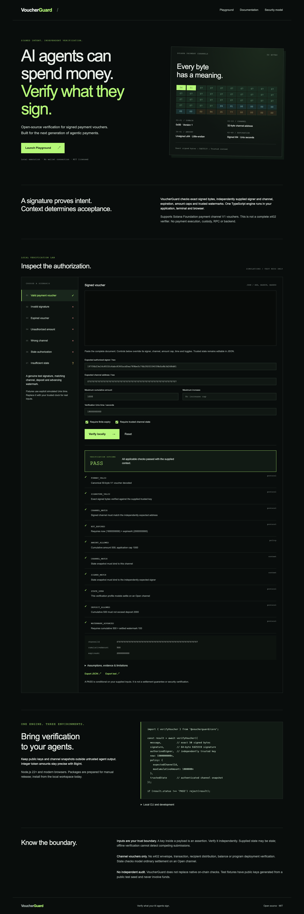

# VoucherGuard

**Verify what your AI agents sign.**

[Live playground](https://voucherguard.pages.dev/) · [Source repository](https://github.com/cg1290-tech/voucherguard)

An offline, open-source verification toolkit for **Solana Foundation payment channel V1 vouchers**. Decode the exact signed message, verify Ed25519 against an independently trusted public key, enforce application policies, and compare cumulative authorization against a supplied trusted channel snapshot.

AI agents can authorize spending. A valid signature alone does not establish that the authorization matches your channel, budget, clock or settlement watermark. VoucherGuard makes those checks explicit and reviewable.

**The free verifier needs no backend, RPC or wallet connection.** No private-key collection, payment execution, telemetry or AI inference. Optional VoucherGuard Pro uses read-only wallet connection and public Solana RPC for holder eligibility. Not an agent platform. Not a full x402 verifier. **Not independently audited.**



## Scope and protocol

Supports the 50-byte Ed25519-signed message from `solana-foundation/payment-channels`, pinned to commit `3ffa4d6728ad88e4a9667a76ad9ccd68a302c696`:

| Offset | Bytes | Meaning |
| --- | --- | --- |
| 0 | 2 | `56 01`: domain `V`, format V1 |
| 2 | 32 | Channel PDA address bytes |
| 34 | 8 | Cumulative amount, little-endian u64 |
| 42 | 8 | Expiration Unix seconds, little-endian i64; zero disables expiry |

Ordinary `settle` requires an Open channel, `settled < cumulative <= deposit`, the channel's authorized signer, matching channel address, and `expiresAt == 0 || now < expiresAt`. The engine mirrors those field checks against **caller-supplied** context; it does not verify an instruction or on-chain account.

x402 v2 has scheme-specific payloads. SVM `exact` uses a signed transaction, not this voucher. SVM `upto` uses payment channels but requires additional checks beyond the voucher; it also forbids non-expiring vouchers. VoucherGuard does **not** validate x402 payment envelopes, `open` transactions, `settle_and_seal` lifecycle requirements, distribution commitments or facilitators. See [protocol research](docs/protocol.md).

## Install and launch locally

Prerequisites: **Node.js 22+**, **pnpm 10.32.1**. Package names are prepared for release; they have not been published to npm.

From this repository:

```sh
pnpm install --frozen-lockfile
pnpm build
pnpm dev
```

Open the URL printed by Vite (normally `http://127.0.0.1:5173`). Development and preview use a temporary local static server; the free verifier ships as static assets; optional Pro balance reads use a Cloudflare Pages relay. After installation, the core, CLI, tests and build require no external services. Browser verification continues without connectivity after assets are loaded. There is no service worker promising offline page reloads.

## SDK quick start

Use the workspace package or a local package path until a reviewed release is published:

```sh
pnpm add ./packages/core
```

```ts
import {
  verifyVoucher,
  parseVoucherDocument,
  serializeReport,
} from '@voucherguard/core';

const input = parseVoucherDocument(JSON.parse(voucherJson));
// Replace payload assertions with independent context:
input.authorizedSigner = trustedAuthorizedSigner; // Uint8Array, 32 bytes
input.policy = {
  expectedChannelId: trustedChannelId,              // Uint8Array, 32 bytes
  maxCumulativeAmount: 1000000n,
  maxIncrease: 100000n,
  rejectNonExpiring: true,
};
input.trustedState = authenticatedSnapshot;
input.now = trustedUnixSeconds;                     // bigint
const report = await verifyVoucher(input);

if (report.status !== 'PASS') {
  throw new Error(serializeReport(report));
}
```

`decodeVoucher(message)` returns `{channelId: Uint8Array, cumulativeAmount: bigint, expiresAt: bigint}`. `encodeVoucher` encodes without signing. `decodeBytes` / `encodeBytes` support explicit hex, canonical padded base64 and base58. `serializeReport` safely represents BigInt as decimal strings and byte arrays as hex. Full [API and document schema](docs/api.md), [integration examples](docs/integrations.md).

## CLI

```sh
node packages/cli/dist/index.js verify examples/valid.json
node packages/cli/dist/index.js verify examples/signature.json --json
node packages/cli/dist/index.js decode examples/valid.json
node packages/cli/dist/index.js inspect examples/state.json
node packages/cli/dist/index.js --help
```

The distributable CLI package exposes the `voucherguard` command. In this workspace:

```sh
pnpm --filter @voucherguard/cli exec node dist/index.js verify ../../examples/valid.json
```

Options: `--json`, `--signer hex:<key>` (also `base58:` / `base64:`), `--channel hex:<id>`, `--max <decimal>`, `--now <Unix seconds>`, `--policy <file>` and `--state <file>`. Flags override file assertions. `--policy` replaces the file policy; `--channel` and `--max` override fields in the resulting policy. `--state` accepts the `trustedState` object documented in the schema, not an entire voucher document.

Exit codes: **0** PASS or successful decode, **1** verification FAIL, **2** INDETERMINATE, **3** invalid input / file / usage. `decode` never claims that a signature was verified. `inspect` performs verification with readable detailed output.

All example documents are simulations with a public test-only seed and explicit simulated time. They are legitimate signatures, not real payments. Never trust a signer or state just because it appears in the same JSON file as the voucher.

## Playground

Paste a document, supply the independently expected signer and channel, edit amount/increase caps and expiry/state policies, then verify locally. Channel state and additional time-window policies can be edited in JSON. Controls explicitly override corresponding JSON fields. Clear Unix time to use the local clock. Changing inputs clears the previous result.

Seven shared fixtures demonstrate valid authorization, signature tampering, expiration, excessive amount, channel mismatch, stale watermark and insufficient state. Export JSON or a readable text report. PNG report export is optional and not implemented; browser screenshots can be taken normally.

## VoucherGuard Pro (pre-launch)

The static website now includes an optional holder toolkit for the future **$VG** token. The official mint is **unset by default**: production shows **Token access coming soon**, and wallet connection alone never unlocks tools. The free verification playground stays available offline.

Pro discovers Wallet Standard-compatible Solana wallets using the official `@wallet-standard` libraries. It requests only a public account, verifies the RPC is mainnet-beta, reads mint decimals and exact-owner/exact-mint SPL Token or Token-2022 accounts, and aggregates raw amounts with BigInt. The default threshold is one whole token; malformed configuration, missing data, unsupported networks and RPC errors close access. Account changes and manual refresh recheck holdings without periodic polling or signing.

The working **Policy Builder** provides amount/increase caps, finite expiry, validity windows, trusted-state requirement and expected channel controls. It uses the core policy schema, previews/copies/downloads JSON and applies only the policy to the free playground while preserving signed bytes, signature and supplied state. Standard/Conservative presets are editable examples, not security guarantees. Batch Verification and Advanced Reports are explicitly planned and unimplemented.

Configure public build variables `VITE_VG_TOKEN_MINT`, `VITE_VG_RPC_URL`, `VITE_VG_HOLDER_THRESHOLD` and `VITE_VG_NETWORK` after independently confirming the official mint. The manual GitHub Pages workflow accepts matching repository variables `VG_TOKEN_MINT`, `VG_RPC_URL`, `VG_HOLDER_THRESHOLD` and `VG_NETWORK`. No mint variable means no holder access. See [configuration, activation and test procedure](docs/pro.md).

**Client-side gating is bypassable.** Bundled JavaScript cannot protect secrets, privileged APIs or exclusive IP. The gate is a convenience feature, not cryptographic wallet authentication or a settlement/security guarantee. Tests provide injected wallet/RPC fixtures outside production code; no development bypass is shipped.

## Results and security boundaries

- **PASS:** all applicable checks passed using the supplied trusted inputs, within the declared scope.
- **FAIL:** at least one definitive check or input validation failed, including when other context is missing.
- **INDETERMINATE:** no definitive failure, but required signer, expected channel or requested state checks could not be completed.

`requireState` defaults to true. To deliberately request signature/channel/expiry/policy verification without deposit/lifecycle/watermark assessment, set it to false; the report states the reduced scope. `maxIncrease` always requires state. State provided explicitly is always validated. Missing signer or expected channel remains INDETERMINATE even in stateless mode.

The protocol settled watermark is strict. `previouslyAcceptedAmount` is an optional **application** watermark, also strict; equality is rejected under that policy. With both watermarks supplied, increase is measured from their maximum.

No offline verifier can authenticate current chain state, discover unseen vouchers or competing submissions, guarantee settlement, or ensure atomic application replay prevention. Your application must authenticate context and atomically reserve/update its acceptance watermark. A report is an observation, not a security certificate. See [SECURITY.md](SECURITY.md).

## Architecture

```text
voucherguard/
├── packages/core/src/       binary codec, crypto, policy, JSON adapters, reports
├── packages/cli/src/        local files and flags; delegates to core
├── apps/web/src/            React static site; delegates to core
├── examples/               seven signed/corrupted test documents
├── tests/                  engine, CLI and real-browser integration
├── scripts/fixtures.ts     public test-key fixture generation
├── docs/                   protocol, API, integrations, deployment, validation
└── .github/workflows/      CI and manually triggered static Pages deployment
```

ESM, strict TypeScript, minimal runtime dependencies (`@noble/curves`, `@scure/base`), no Node built-ins in the core. Crypto uses maintained noble Ed25519 with strict `zip215:false` verification. Canonical encoding/small-order rejection is intentionally conservative; consensus equivalence for exotic Ed25519 edge cases is not claimed. Browser uses native BigInt and system fonts with no remote resources.

## Development and verification

```sh
pnpm fixtures                 # reproducible PUBLIC TEST ONLY signatures
pnpm typecheck
pnpm lint
pnpm build
pnpm test                     # core + CLI, requires built packages
pnpm check                    # all preceding validation in correct order
pnpm exec playwright install chromium
pnpm test:browser             # production site under /voucherguard/, offline checks
```

Initial Playwright browser installation downloads a test browser; this is a development requirement only. CI runs type checks, lint, production build, core/CLI tests, and browser tests. See [executed validation](docs/validation.md).

## Static deployment

`apps/web/dist` contains static assets plus the optional read-only Pages RPC worker. Relative assets support GitHub Pages subpaths; no history routing is used. See [deployment instructions](docs/deployment.md). The production site at [voucherguard.pages.dev](https://voucherguard.pages.dev/) uses Cloudflare Pages Direct Upload; GitHub commits do not automatically update it. GitHub Pages remains a fallback with a workflow that runs **only on manual dispatch**. The source repository is published under cg1290-tech. npm packages are not published.

## Roadmap and contributions

Before a stable production release: independent security review and maintainer verification of the protocol pin and release metadata. Private vulnerability reporting is enabled on the repository. Future scope may include additional independently tested protocol profiles; no generic multi-chain or comprehensive x402 support is promised.

Contributions should include protocol evidence and tests for security behavior. Read [CONTRIBUTING.md](CONTRIBUTING.md). MIT license; no endorsements, adoption claims or audit certification.
